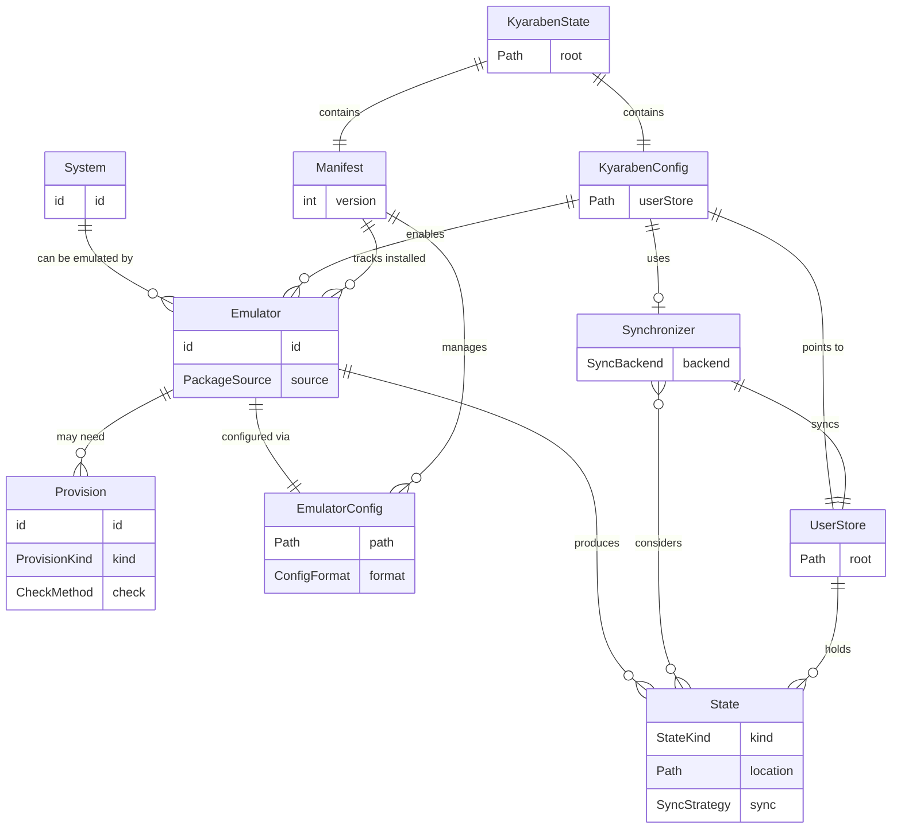

# Kyaraben domain model

Living document describing the core domain entities and their relationships.

## Diagram



## Entities

### System

A gaming platform that can be emulated.

Examples: `snes`, `psx`, `gamecube`, `switch`

A system is an abstract concept. It doesn't know about file formats or requirements directly - those are owned by emulators.

### Emulator

An implementation that runs a system's games.

Examples: `retroarch:bsnes`, `duckstation`, `dolphin`, `eden`

RetroArch + core is just an emulator identifier; cores are an implementation detail, not a separate domain concept.

An emulator:

- Has a package source (nixpkgs, GitHub release)
- Knows which files it can run
- May need provisions (BIOS, keys, etc.)
- Produces state (saves, cache, etc.)
- Is configured via config files in specific formats

Versioning: each emulator has a semver version, tracked in `Manifest` when installed. Non-breaking updates happen within the same emulator ID. If an emulator has a breaking change (config format, state locations), it becomes a new emulator ID (e.g., `duckstation` vs `duckstation-legacy-1x`). This keeps config generation simple - each emulator ID represents a stable contract - while still supporting version tracking for updates and observability.

### Provision

Something the user provides to an emulator to enable or enhance functionality.

Belongs to Emulator, not System. Different emulators for the same system may have different provision needs. Kyaraben can recognize when a provision satisfies multiple emulators for the same system.

Each provision:

- Can be checked: is it satisfied?
- Has instructions for the user
- Describes what it enables

Kind (not fully enumerated yet):

- `bios` - system BIOS
- `keys` - decryption keys
- Possibly others: firmware, patches - distinctions TBD

### State

Data an emulator produces during operation.

Owned by Emulator. Lives in UserStore.

Kind:

- `saves` - game progress (memory cards, battery saves)
- `savestates` - emulator snapshots
- `screenshots` - captured images
- `cache` - shader cache, regenerable data
- `persistent` - emulator-managed storage

Sync strategy:

- `bidirectional` - sync both ways
- `send-only` - push only
- `ignore` - don't sync

### EmulatorConfig

A configuration file for an emulator.

- Has a path
- Has a format (INI, CFG, TOML, XML)
- Kyaraben generates and manages these via three-way merge

### ConfigPatch

Represents changes kyaraben wants to make to an `EmulatorConfig`.

- References the target `EmulatorConfig`
- Contains a list of `ConfigEntry` values (section, key, value)
- Generated by `ConfigGenerator` implementations for each emulator
- Applied by `ConfigWriter` which preserves existing user settings

### KyarabenConfig

Kyaraben's own configuration.

Default location: `~/.config/kyaraben/config.toml`

- Declares which systems are enabled with their emulators
- Each system maps to a list of emulator IDs
- Points to UserStore location
- Configures Synchronizer (if enabled)
- Optional emulator-specific settings (version pinning)

### Synchronizer

Handles syncing state across devices.

- Knows about UserStore
- Respects State sync strategies (bidirectional, send-only, ignore)
- Backend is pluggable (Syncthing initially, others possible)

Configured via KyarabenConfig. Optional - not all users want sync.

### KyarabenState

Where kyaraben keeps its internal state.

Follows XDG conventions:

- Config: `~/.config/kyaraben/`
- Data: `~/.local/share/kyaraben/` (Nix store, installed emulators)
- State: `~/.local/state/kyaraben/` (manifest, runtime state)

Separate from UserStore. This is kyaraben's concern, not the user's.

### UserStore

Where the user's emulation data lives.

Default: `~/Emulation`

Contains:

- ROMs (user-provided)
- BIOS/provisions (user-provided)
- Saves, savestates, screenshots (emulator-produced)

This is what the user sees and interacts with. This is what gets synced.

### Manifest

Tracks what kyaraben has done.

Lives in KyarabenState.

- Managed emulator configs (with base snapshots for diffing)
- Installed emulators (with versions)
- Enables observability

## Domain services

### Registry

Central repository for known `Systems` and `Emulators`.

- Maps `SystemID` to `System`
- Maps `EmulatorID` to `Emulator`
- Provides lookup: `GetSystem`, `GetEmulator`, `GetEmulatorsForSystem`
- Provides defaults: `GetDefaultEmulator` returns the recommended emulator for a system
- Provides config generation: `GetConfigGenerator` returns the `ConfigGenerator` for an emulator

The registry is populated at startup with hardcoded definitions. Systems and emulators are registered in code rather than configuration files for simplicity.

### ConfigGenerator

Interface for generating `ConfigPatch` values for an emulator.

- `Generate(userStore, systems)` returns patches to apply
- Each emulator type has its own implementation (e.g., `RetroArchConfig`, `DuckStationConfig`)
- Implementations know which paths to set based on `UserStore` location

## Relationships

- A **System** can be emulated by many **Emulators**
- An **Emulator** targets one or more **Systems**
- An **Emulator** may need **Provisions**
- An **Emulator** produces **State**
- An **Emulator** is configured via **EmulatorConfig**
- **KyarabenConfig** maps **Systems** to lists of **Emulators**, points to **UserStore**, configures **Synchronizer**
- **KyarabenState** contains **KyarabenConfig** and **Manifest**
- **UserStore** holds **State** and user-provided files
- **Manifest** manages **EmulatorConfigs** (with base snapshots) and tracks installed **Emulators** (with versions)
- **Synchronizer** syncs **UserStore**, respects **State** sync strategies

## Storage model

Two distinct storage areas:

```
KyarabenState (XDG)
├── ~/.config/kyaraben/          # KyarabenConfig
├── ~/.local/share/kyaraben/     # Nix store, emulator binaries
└── ~/.local/state/kyaraben/     # Manifest, runtime state

UserStore (explicit, e.g. ~/Emulation)
├── roms/
├── bios/
├── saves/           # Structured by system (for emulators with path config)
├── states/          # Structured by emulator
├── screenshots/
└── opaque/          # Emulators that manage their own directory structure
    └── <emulator>/
```

**Opaque emulator directories:** Some emulators (e.g., Eden for Switch) have internal directory structures that don't map to kyaraben's saves/states model. For these, we place the emulator's entire data directory at `UserStore/opaque/<emulator>/`. The emulator manages the internal structure; kyaraben syncs it as a unit. See FILESYSTEM.md for details.

## Open questions

1. Provision kinds: what's the full taxonomy? Is firmware distinct from BIOS? How do patches fit?
2. ~~How does kyaraben map emulator-native state paths to the unified UserStore layout?~~ Resolved: configure emulator paths directly; use opaque directories for emulators that resist this.
3. Should UserStore structure be configurable or opinionated?
4. Emulator version tracking: currently always "latest". Real versions require parsing Nix derivation metadata. Worth it?
