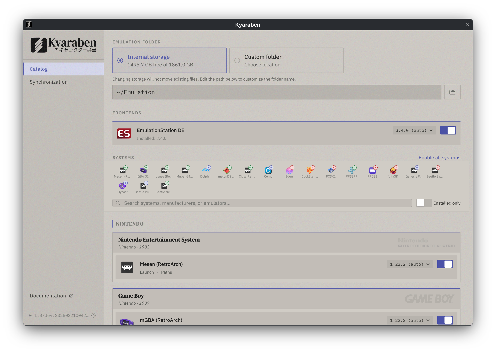

<p align="center">
  
</p>

<p align="center">
  <a href="https://github.com/fnune/kyaraben/blob/main/LICENSE"></a>
</p>

Emulation setup for Linux with automated Syncthing management.

Runs on desktop, Steam Deck, and headless server. Guest integrations include NextUI handhelds, with more planned.

<p align="center">
  
</p>

## Installation

Download the latest AppImage from the [releases page](https://github.com/fnune/kyaraben/releases) and run it:

```bash
chmod +x Kyaraben-*.AppImage
./Kyaraben-*.AppImage
```

## How it works

1. Select the systems you want to emulate
2. Click apply - Kyaraben downloads and configures emulators
3. Drop your ROMs into the created folders
4. Enable sync to synchronize saves across devices

Kyaraben shows which BIOS or firmware files are required for each system.

## Requirements

- Linux (x86_64)
- systemd (for sync; emulators work without it)

## Documentation

- [Getting started](https://kyaraben.dev/getting-started/)
- [Setup guides](https://kyaraben.dev/setups/)
- [App reference](https://kyaraben.dev/using-the-app/)
- [CLI reference](https://kyaraben.dev/using-the-cli/)
- [Synchronization](https://kyaraben.dev/sync/)
- [NextUI integration](https://kyaraben.dev/nextui/)

## Contributing

See the [contributing guide](site/src/content/docs/contributing.mdx) for development setup and conventions.

## License

MIT

---

<sub>System logos from [ES-DE](https://es-de.org)</sub>
