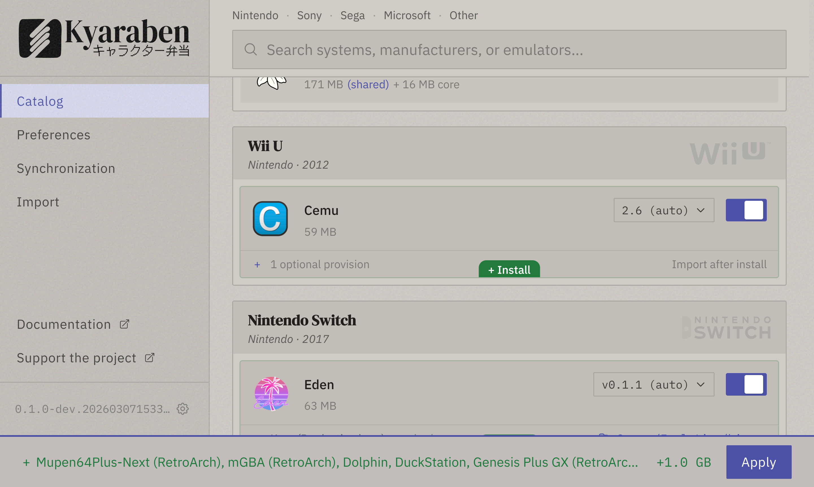

<p align="center">
  
</p>

<p align="center">
  <a href="https://github.com/fnune/kyaraben/blob/main/LICENSE"></a>
</p>

Emulation setup for Linux with automated Syncthing management. Runs on desktop, Steam Deck, and headless server. Guest integrations include NextUI handhelds, with more planned.

> [!WARNING]
> Kyaraben is pre-alpha software. Feedback and bug reports are welcome on [GitHub Issues](https://github.com/fnune/kyaraben/issues).

<p align="center">
  
</p>

## How it works

1. Download the AppImage and run it
2. Select the systems you want to emulate
3. Click apply
4. Drop your ROMs into the created folders and play
5. Enable sync, pair with a 6-digit code, and your collection and saves follow you across devices

Emulators are downloaded as self-contained AppImages and Syncthing is configured automatically, so no Flatpak, system packages, or manual setup is needed. On Steam Deck, sync works in Game Mode. See the [guides](https://kyaraben.dev/guides/desktop-and-steam-deck/) to get started.

## Supported systems and devices

Kyaraben supports consoles from Atari 2600 through PlayStation 3 and Nintendo Switch. See the [emulator support table](https://kyaraben.dev/using-the-app/#emulator-support) for the full list of systems and emulators.

Kyaraben runs on any x86_64 Linux distribution, including SteamOS on the Steam Deck. ARM64 is experimental and untested. NextUI handhelds sync as guest devices, with more guest app integrations planned.

## Configuration visibility

Kyaraben manages specific config keys in emulator config files and shows diffs before each apply. You see exactly what Kyaraben writes, which keys it controls, and what changes across updates. See [app reference](https://kyaraben.dev/using-the-app/#configuration-management) for details.

## Installation

Download the latest AppImage from the [releases page](https://github.com/fnune/kyaraben/releases) and run it:

```bash
chmod +x Kyaraben-*.AppImage
./Kyaraben-*.AppImage
```

## Requirements

- Linux (x86_64)
- systemd (for sync; emulators work without it)

## Documentation

- [Getting started](https://kyaraben.dev/getting-started/)
- [Setup guides](https://kyaraben.dev/guides/)
- [App reference](https://kyaraben.dev/using-the-app/)
- [CLI reference](https://kyaraben.dev/using-the-cli/)
- [Synchronization](https://kyaraben.dev/sync/)
- [NextUI integration](https://kyaraben.dev/nextui/)

## Contributing

See the [contributing guide](site/src/content/docs/contributing.mdx) for development setup and conventions.

## License

MIT

---

<sub>System logos from [ES-DE](https://es-de.org)</sub>
