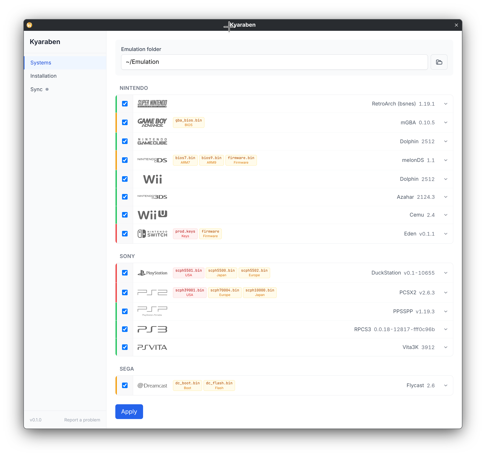

# Kyaraben

Kyaraben is a declarative emulation manager for Linux. It handles the installation and configuration of emulators for various gaming systems.

This project is in development.

  

## How it works

1. Select the systems you want to emulate
2. Click apply to install the emulators and configure them
3. Kyaraben shows which BIOS or firmware files are required for each system

Kyaraben uses Nix to install emulators, which means installations are reproducible and isolated from the rest of your system. You do not need to have Nix installed; Kyaraben bundles a portable Nix distribution.

## Documentation

See the [documentation site](site/) for user guides, configuration reference, and technical details.

## Contributing

See the [development guide](site/src/content/docs/contributing/index.mdx) for conventions and setup instructions.

---

System logos from [ES-DE](https://es-de.org)
