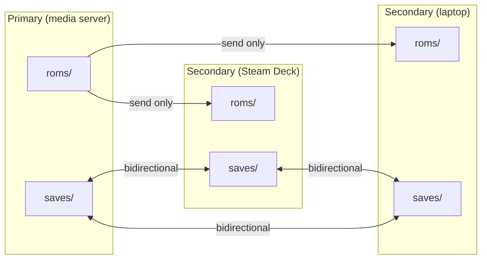
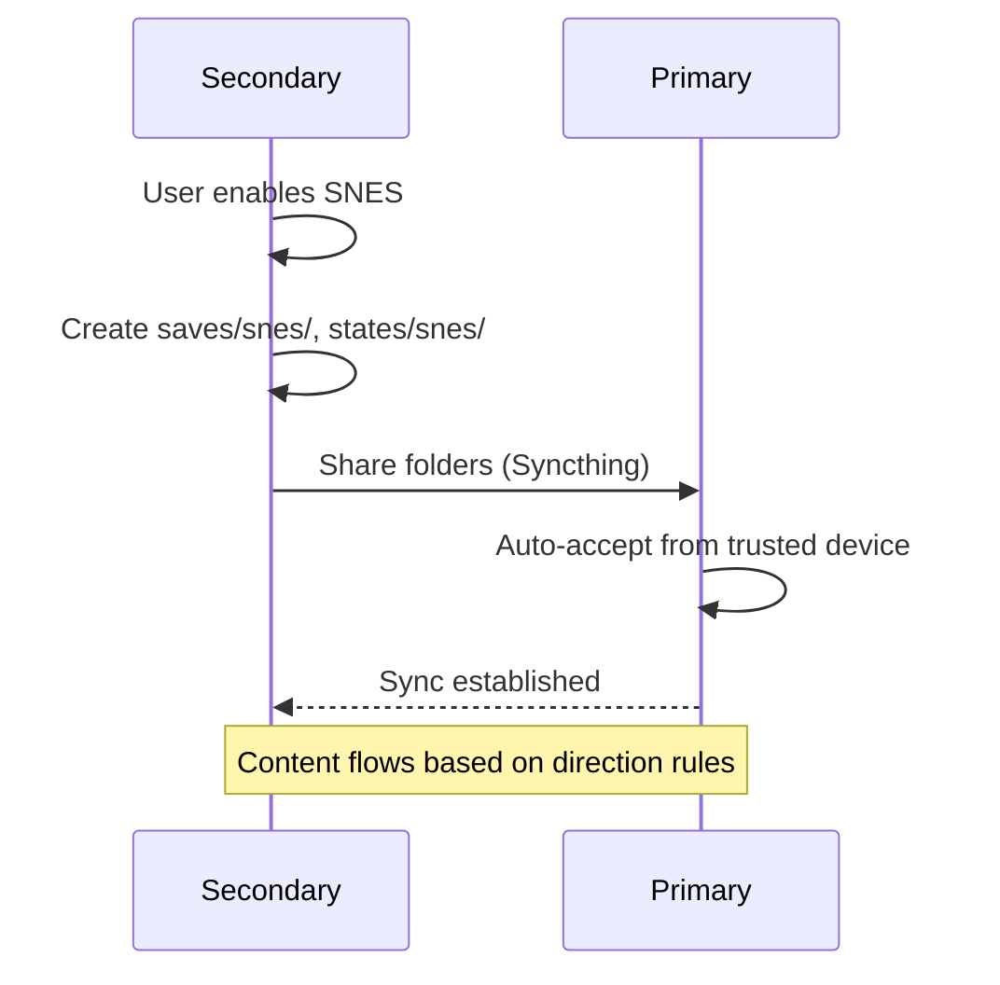

# Sync

Kyaraben uses Syncthing to synchronize emulation state across devices.

## Roles

A device operates as either `primary` or `secondary`:

- `primary`: Creates all system folders, shares them. Optional emulator installation.
- `secondary`: Subscribes to folders for enabled systems, installs emulators.



## Sync direction by content type

| Content | Primary | Secondary |
|---------|---------|-----------|
| `roms/` | Send only | Receive only |
| `bios/` | Send only | Receive only |
| `saves/` | Bidirectional | Bidirectional |
| `states/` | Bidirectional | Bidirectional |
| `screenshots/` | Bidirectional | Bidirectional |
| `opaque/` | Bidirectional | Bidirectional |

## Folder creation

Primary creates all system folders on apply, regardless of which systems have emulators enabled. This ensures users always know where to put ROMs.

Secondary creates folders only for enabled systems.

## Secondary-initiated subscription



Secondary drives which systems to sync. Primary auto-accepts folder shares from paired devices.

## Bundled Syncthing

Kyaraben ships its own Syncthing instance to avoid conflicts with existing user installations.

| Setting | Default | Notes |
|---------|---------|-------|
| Config directory | `~/.config/kyaraben/syncthing/` | Separate from system Syncthing |
| Listen port | 22001 | Configurable |
| Discovery port | 21028 | Configurable |
| GUI port | 8385 | Configurable |
| Relay servers | Enabled | Configurable |
| Device name | `<hostname>-kyaraben` | |

The Syncthing GUI is accessible for visibility but kyaraben may overwrite manual changes on apply.

## Configuration

```toml
[sync]
enabled = true
mode = "primary"

[sync.syncthing]
listen_port = 22001
discovery_port = 21028
gui_port = 8385
relay_enabled = true

[[sync.devices]]
id = "XXXXXXX-XXXXXXX-XXXXXXX-XXXXXXX"
name = "steamdeck"

[sync.ignore]
patterns = [
  "**/shader_cache/**",
  "**/cache/**",
  "**/*.tmp",
  ".DS_Store",
  "Thumbs.db",
]
```

System selection controls emulator installation. On primary, all folders are created and shared regardless of system selection.

## File versioning

Syncthing keeps old versions of files in `saves/`, `states/`, and `opaque/` directories. Versions are kept for 30 days with staggered cleanup.

## UI

A sync status bar shows connection state with color coding:

- Green: synced
- Blue: syncing
- Yellow: conflicts
- Red: disconnected
- Gray: disabled

Clicking the status bar opens the Syncthing GUI in a browser.

The system grid shows a subtle indicator on each card displaying content size available from primary.

## CLI

```
kyaraben sync status     # Show sync state and Syncthing GUI URL
kyaraben sync add-device # Pair with another device
kyaraben sync remove-device
```
