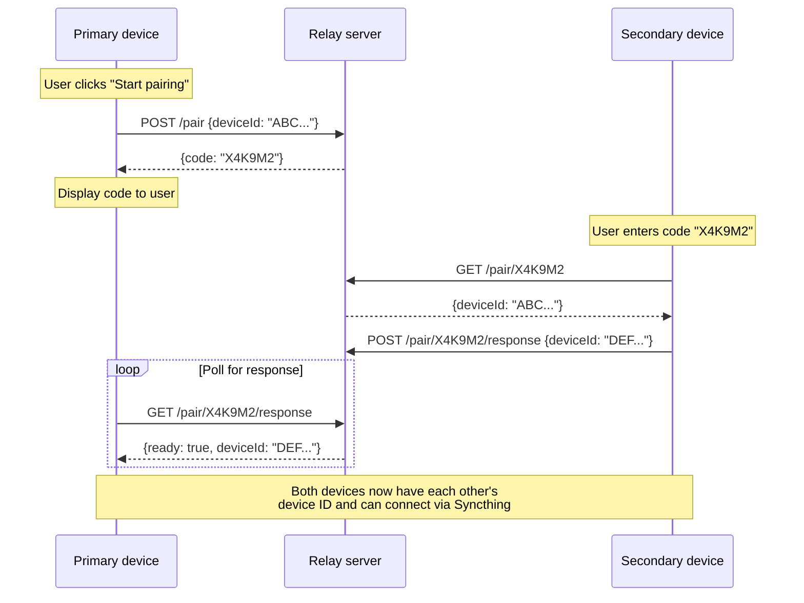

# Kyaraben relay

A lightweight relay server that enables kyaraben devices to pair using short 6-character codes instead of 56-character Syncthing device IDs.

## How it works



## Running locally

```sh
go run ./cmd/relay
```

The server listens on `:8080` by default. Override with `-addr` flag or `PORT` environment variable.

## API

| Method | Path | Description |
|--------|------|-------------|
| POST | /pair | Create pairing session, returns 6-char code |
| GET | /pair/:code | Get primary's device ID |
| POST | /pair/:code/response | Submit secondary's device ID |
| GET | /pair/:code/response | Poll for secondary's response |
| DELETE | /pair/:code | Cancel session |
| GET | /health | Health check |

Sessions expire after 5 minutes. Rate limits apply per IP.

## Deployment

The relay is deployed to Koyeb using Pulumi. Deployment runs automatically on merge to main when relay code changes.

### Manual deployment

```sh
cd pulumi
pulumi up
```

Requires `KOYEB_TOKEN` environment variable.

### CI/CD setup

The GitHub Actions workflow uses Pulumi ESC for secrets:

1. Configure OIDC trust in Pulumi Cloud:
   - Settings → Access Management → OIDC Issuers
   - Add issuer: `https://token.actions.githubusercontent.com`
   - Subject filter: `repo:fnune/kyaraben:*`

2. Create ESC environment `kyaraben/relay-deploy`:
   ```yaml
   values:
     koyeb:
       token:
         fn::secret: "your-koyeb-api-token"
     environmentVariables:
       KOYEB_TOKEN: ${koyeb.token}
   ```

3. Create Pulumi stack: `pulumi stack init prod`
